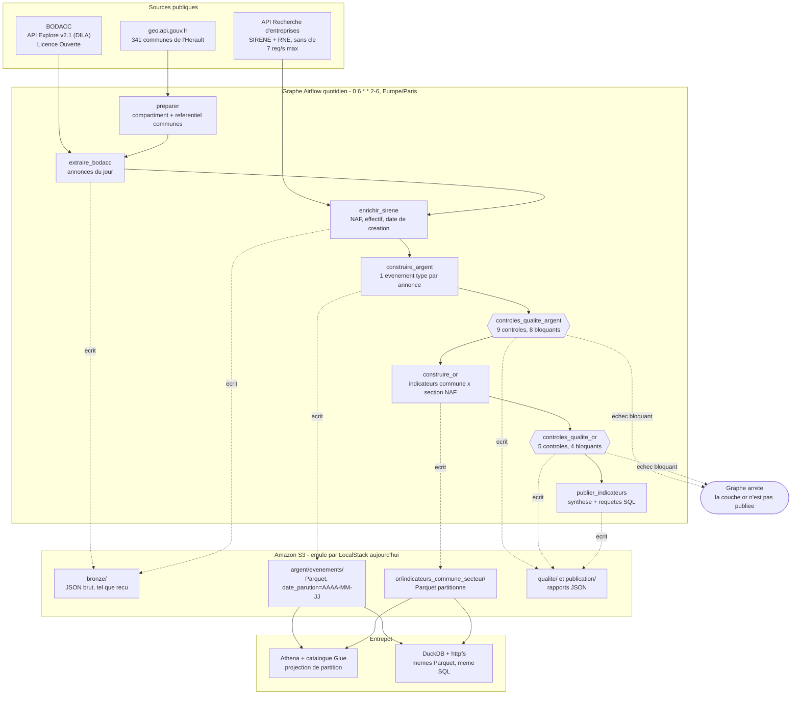

# Radar economique des entreprises de l'Herault

[](https://github.com/yzasmin/radar-entreprises-herault/actions/workflows/ci.yml)

Creations, immatriculations, transferts, ventes de fonds, radiations et procedures collectives des
entreprises de l'Herault, captes chaque jour au **BODACC**, enrichis par **SIRENE**, ranges en
Parquet partitionne sur **S3** en trois couches, controles par des tests de qualite **bloquants**, et
interrogeables en SQL par **Athena** ou par **DuckDB**. Le tout orchestre par un graphe **Airflow**
quotidien.

> **Ce qui a reellement tourne.** Le graphe publie ici a ete execute en integration continue, contre
> un **S3 emule par LocalStack**, pas contre un vrai compte AWS. Le code appelle strictement les memes
> fonctions boto3 dans les deux cas : seule la variable `AWS_ENDPOINT_URL` change. La section
> [Bascule vers le vrai compte AWS](#bascule-vers-le-vrai-compte-aws) donne la commande unique qui
> rejoue le meme graphe sur le compartiment reel, et la politique IAM minimale qui va avec.
> Athena n'a pas tourne non plus : LocalStack en edition communautaire ne l'emule pas. Le moteur de
> requete execute est DuckDB, sur exactement les memes fichiers Parquet.

Portfolio : <https://yzasmin.github.io/>

---

## Probleme

Une equipe commerciale qui prospecte dans l'Herault, un bailleur qui suit ses locataires
professionnels, un cabinet de conseil qui surveille un portefeuille de clients ont tous besoin de la
meme chose : savoir **qui ouvre, qui bouge et qui tombe**, par commune et par secteur, et le savoir
le jour ou c'est publie.

L'information existe et elle est publique. Le Bulletin officiel des annonces civiles et commerciales
publie chaque jour ouvre les creations, les immatriculations, les modifications, les radiations, les
ventes de fonds et les jugements de procedure collective. Mais telle quelle, elle est inexploitable :

- elle arrive **par annonce juridique**, pas par entreprise ni par territoire ;
- les champs qui portent le sens (`jugement`, `acte`, `listepersonnes`) sont du **JSON serialise dans
  une colonne texte**, et le montant d'une vente de fonds est une phrase en francais ;
- la **famille d'avis ment** : une « immatriculation » est souvent un simple transfert de siege, et
  une « liquidation sur conversion de redressement » contient les deux mots ;
- il n'y a **ni code commune, ni code d'activite** : seulement un nom de ville saisi a la main et un
  code postal.

Ce projet construit la brique manquante : un graphe quotidien qui capte ce flux, le normalise, le
rattache a une commune et a un secteur, refuse de publier si les donnees ne passent pas les controles,
et livre des indicateurs interrogeables en SQL.

---

## Architecture



### Les trois couches

| Couche | Contenu | Format | Partition |
| --- | --- | --- | --- |
| **bronze** | Les annonces telles que la source les rend, sans aucune transformation, plus les fiches SIRENE et le referentiel des communes | JSON | `date_parution=AAAA-MM-JJ` |
| **argent** | Un evenement type par annonce : type normalise, gravite, SIREN valide, commune du referentiel, section NAF, montant de vente | Parquet Snappy | `date_parution=AAAA-MM-JJ` |
| **or** | Indicateurs quotidiens par commune et par section NAF : ouvertures, transferts, ventes, radiations, defaillances, solde net | Parquet Snappy | `date_parution=AAAA-MM-JJ` |

La cle de partition **n'est pas dans le fichier Parquet**, uniquement dans le chemin. Athena refuse
une colonne qui est aussi une colonne de partition, DuckDB echoue sur un nom en double avec
`hive_partitioning = true`, et la valeur n'est stockee qu'une fois au lieu d'une fois par ligne.
Un test verrouille cette propriete (`test_le_parquet_ne_contient_pas_la_cle_de_partition`).

### Ce que le code fait que la source ne fait pas

| Traitement | Pourquoi il est necessaire |
| --- | --- |
| Classement en 14 types d'evenements | La famille d'avis ne distingue ni le transfert de la creation, ni la liquidation du redressement. Le sens est dans le texte libre de `acte.descriptif` et de `jugement.complementJugement` |
| Validation du SIREN par cle de Luhn | Le champ `registre` est une liste qui repete la meme identite sous deux formes et melange vendeur et acheteur. Exception documentee par l'INSEE : le SIREN de La Poste (356000000) ne respecte pas la cle |
| Rattachement a une commune du referentiel | La source ne donne qu'un nom saisi a la main. Trois tentatives successives : nom normalise (accents, casse, `ST` en `SAINT`, arrondissements, `CEDEX`), puis code postal sans ambiguite, puis prefixe. L'echec est explicite, jamais devine |
| Lecture du montant d'une vente de fonds | Le prix est une phrase : « acquis par achat au prix stipule de 345000.00 euros ». Un montant illisible reste nul, jamais zero : zero est un prix, l'absence n'en est pas un |
| Section NAF a partir du code d'activite | Les 732 codes NAF ne se lisent pas ; les 21 sections oui |

---

## Resultats reels

<!-- RESULTATS -->

---

## Reproduire depuis un clone vierge

```bash
git clone https://github.com/yzasmin/radar-entreprises-herault.git
cd radar-entreprises-herault
cp .env.example .env          # valeurs par defaut : LocalStack, aucun secret
```

### Sans Docker : les tests et le pipeline en ligne de commande

```bash
# Environnement Python (uv telecharge Python 3.12 si besoin)
python -m uv sync --frozen

# Tests unitaires et style
python -m uv run pytest -q
python -m uv run ruff check src tests dags scripts

# Preuve que les controles de qualite bloquent reellement
python -m uv run python scripts/preuve_blocage.py

# Verifie que chaque chiffre du README existe dans results/
python -m uv run python scripts/verifier_chiffres.py README.md
```

Les tests du graphe Airflow sont **sautes** ici et annonces comme tels : Airflow n'est pas installe
sur un poste de developpement, il l'est dans le conteneur.

### Avec Docker : la pile complete

```bash
docker compose up -d --build          # Airflow, PostgreSQL et LocalStack
# Interface Airflow : http://localhost:8080 (identifiants dans .env)

# Executer reellement le graphe sur une parution
docker compose run --rm airflow-cli \
  airflow dags test radar_entreprises_herault 2026-09-22

# Exporter les chiffres publies et tracer les figures
AWS_ENDPOINT_URL=http://localhost:4566 \
  python -m uv run python scripts/export_results.py --jour 2026-09-22
python -m uv run python scripts/figures.py --jour 2026-09-22

docker compose down                   # arret propre, sans perdre les volumes
```

`make aide` liste les memes commandes sous forme de raccourcis.

### Infrastructure decrite en code

```bash
cd infra/terraform
terraform fmt -check -recursive
terraform init -backend=false
terraform validate                    # ne demande aucun compte AWS
```

---

## Bascule vers le vrai compte AWS

Trois commandes, une fois la cle d'acces creee dans la console IAM.

```bash
# 1. Renseigner la cle. AWS_ENDPOINT_URL doit rester VIDE : c'est cette ligne qui bascule.
$EDITOR .env        # AWS_ACCESS_KEY_ID, AWS_SECRET_ACCESS_KEY, AWS_ENDPOINT_URL=

# 2. Creer le catalogue, le workgroup Athena et les politiques IAM (le compartiment existe deja)
cd infra/terraform && terraform init && terraform apply && cd ../..

# 3. Rejouer exactement le meme graphe, cette fois sur le vrai compartiment
./scripts/bascule_aws.sh 2026-09-22
```

La troisieme commande verifie l'acces, refuse de partir si `AWS_ENDPOINT_URL` n'est pas vide ou si la
cle ressemble a celle de LocalStack, puis enchaine le diagnostic, l'execution du graphe et l'export
des chiffres. Elle n'affiche jamais la cle et n'ecrit rien dans le depot.

### Region : eu-west-3 (Paris)

Choix par defaut, pour trois raisons :

1. **Les donnees sont francaises et le lecteur est en France.** La latence entre l'ordonnanceur et S3
   compte peu ici, mais celle entre Athena et le poste qui lit les resultats se voit.
2. **Residence des donnees.** Les annonces BODACC sont publiques, donc sans contrainte legale, mais
   garder l'ensemble du projet dans une region de l'Union europeenne evite d'avoir a se poser la
   question le jour ou une donnee client s'y ajoute. C'est une habitude, pas une obligation ici.
3. **Le cout est comparable** aux regions irlandaises pour S3 et Athena, a ce volume (moins de
   100 Mo par an pour le departement) la difference est invisible.

La region est une variable, pas une constante : `AWS_REGION` dans `.env`, `var.region` dans Terraform.
Aucun code ne la contient en dur.

### Droits minimaux de la cle

La politique prete a coller est dans **`infra/politique-minimale.json`**, expliquee ligne par ligne
dans **`infra/POLITIQUE.md`**. En resume :

| Accorde | Sur |
| --- | --- |
| `s3:ListBucket`, `s3:GetBucketLocation` | `arn:aws:s3:::amzn-s3-seau`, avec une condition `s3:prefix` limitee a `radar/` |
| `s3:GetObject`, `s3:PutObject`, `s3:AbortMultipartUpload`, `s3:ListMultipartUploadParts` | `arn:aws:s3:::amzn-s3-seau/radar/*` |
| Un `Deny` explicite avec `NotResource` | tout ce qui sort du compartiment et de son prefixe |

**Aucune suppression n'est accordee** : ni `s3:DeleteObject`, ni `s3:DeleteBucket`. Le graphe ecrase
une partition en reecrivant la meme cle, il n'a jamais besoin de supprimer. Pas de `s3:CreateBucket`
non plus : le compartiment existe deja. Les droits Athena et Glue, necessaires seulement quand
`RADAR_MOTEUR=athena`, sont decrits dans `infra/terraform/iam.tf` et ne sont pas accordes tant
qu'Athena n'est pas utilise.

### Secrets

`.env` est dans `.gitignore`, `.env.example` est commite et ne contient que des valeurs LocalStack.
**Terraform cree l'utilisateur IAM et les politiques mais pas la cle d'acces** : une cle creee par
Terraform finirait en clair dans le fichier d'etat. Elle se cree a la main, une fois, et va dans
`.env` ou dans un secret GitHub. Le depot a ete scanne avant chaque publication.

---

## Structure

```
radar-entreprises-herault/
├── dags/radar_entreprises.py        Le graphe, et rien que le graphe
├── src/radar/
│   ├── config.py                    Tout vient de l'environnement, aucun secret en dur
│   ├── extract.py                   BODACC, SIRENE, referentiel geo, cadence de requetes
│   ├── transform.py                 Fonctions pures : classement, SIREN, communes, agregats
│   ├── quality.py                   14 controles, bloquants ou non, rendus en tableau lisible
│   ├── storage.py                   boto3 : memes appels sur LocalStack et sur AWS
│   ├── warehouse.py                 Athena et DuckDB derriere la meme fonction
│   ├── pipeline.py                  Une fonction par tache du graphe
│   └── cli.py                       Rejouer une etape ou tout le graphe, sans ordonnanceur
├── sql/
│   ├── indicateurs.sql              7 requetes, le meme texte pour les deux moteurs
│   └── athena_ddl.sql               Tables externes avec projection de partition
├── infra/
│   ├── politique-minimale.json      Politique IAM prete a coller dans la console
│   ├── POLITIQUE.md                 Ce qu'elle autorise, ce qu'elle refuse, et pourquoi
│   └── terraform/                   Compartiment, catalogue Glue, workgroup Athena, IAM
├── scripts/
│   ├── export_results.py            Ecrit dans results/ tout ce qui est publie
│   ├── figures.py                   Graphiques du README, de la fiche et du teaser
│   ├── preuve_blocage.py            Prouve que les controles arretent le graphe
│   ├── verifier_chiffres.py         Verifie que chaque nombre publie existe dans results/
│   └── bascule_aws.sh               Bascule vers le vrai compte, en une commande
├── tests/                           Transformations, qualite, S3 simule (moto), graphe Airflow
├── results/                         Sorties chiffrees du run d'integration continue
├── teaser/                          variables.json et figure 1600x900 du portfolio
├── docker/Dockerfile.airflow        Airflow 2.10.5 epingle, plus quatre dependances
└── docker-compose.yml               Airflow LocalExecutor, PostgreSQL, LocalStack
```

---

## Donnees et licences

| Source | Ce qu'elle apporte | Licence | Frequence | Verifie le |
| --- | --- | --- | --- | --- |
| [BODACC](https://www.data.gouv.fr/fr/datasets/bodacc/), API Explore v2.1 d'Opendatasoft hebergee par la DILA | Les annonces legales : creations, immatriculations, modifications, radiations, ventes et cessions, procedures collectives, depots des comptes | **Licence Ouverte** (`FR-LO`), producteur DILA (services du Premier ministre) | Quotidienne, du mardi au samedi | 23/09/2026 |
| [API Recherche d'entreprises](https://recherche-entreprises.api.gouv.fr/docs/) | Code NAF, tranche d'effectif, date de creation, commune du siege | Donnees SIRENE et RNE sous **Licence Ouverte 2.0**, code de l'API sous MIT. **Sans cle**, 7 requetes par seconde et par adresse IP | Quotidienne | 23/09/2026 |
| [geo.api.gouv.fr](https://geo.api.gouv.fr/decoupage-administratif/communes) | Les 341 communes de l'Herault : code INSEE, codes postaux, population, centroide | **Licence Ouverte** | Annuelle | 23/09/2026 |

Volumetrie constatee le 23/09/2026 : **50 760 501** annonces au total dans le jeu BODACC, dont
**1 086 441** pour le seul departement de l'Herault. La parution du jour meme etait deja interrogeable.

### Ce qui a ete evalue puis ecarte, et pourquoi

| Source | Mesure | Decision |
| --- | --- | --- |
| **Fichiers stock SIRENE** sur data.gouv.fr (Licence Ouverte 2.0) | `StockEtablissement` en Parquet : **2 210 114 710 octets**, soit 2,21 Go, plus 708 557 254 octets pour `StockUniteLegale`. Mise a jour **mensuelle** | Ecarte. Un stock mensuel ne peut pas porter un radar quotidien, et 2,2 Go a telecharger puis filtrer a chaque rafraichissement sur un poste de 8 Go de memoire vive n'est pas tenable |
| **API SIRENE 3.11 de l'INSEE** | **HTTP 401** sans jeton : un compte INSEE et une cle sont necessaires | Ecarte pour l'instant. C'est la porte a reprendre le jour ou la cle existe, pour acceder aux variables non diffusibles |
| **Enumeration des etablissements par l'API ouverte** | `?departement=34` renvoie `total_results: 10000`, qui est le **plafond de pagination**, pas un comptage | Ecarte. C'est ce qui a decide l'architecture : le flux porte la liste, le referentiel ne fait qu'enrichir. Quelques centaines d'appels par jour au lieu de 2,2 Go par mois |

### Perimetre et extension

Le perimetre est le **departement 34**, fixe par la variable `RADAR_DEPARTEMENT`. Pour l'etendre :

- **A un autre departement** : changer `RADAR_DEPARTEMENT`. Rien d'autre. Le referentiel des communes
  est charge depuis `geo.api.gouv.fr` pour le departement demande, et le controle
  `perimetre_departemental` verifie que tous les codes commune en decoulent.
- **A une region ou a la France entiere** : il faut sortir du plafond de pagination de 10 000 lignes
  de l'API Explore. Deux voies, dans l'ordre de cout : decouper la requete par famille d'avis puis par
  departement (le code leve deja explicitement quand le plafond est atteint, au lieu de tronquer en
  silence), ou passer au flux XML annuel publie sur data.gouv.fr, qui pese environ 50 Go et demande
  une autre chaine de lecture.
- **A une profondeur historique** : le graphe accepte n'importe quelle date de parution. Rejouer un an
  demande 250 executions, soit environ deux heures a la cadence actuelle.

### Ce qui n'est pas commite

Aucune donnee source n'est versionnee : le graphe les telecharge. Seules les **sorties chiffrees**
sont dans `results/`, parce que c'est la regle du portfolio : tout chiffre publie doit s'y retrouver.

---

## Limites

<!-- LIMITES -->

---

## Credits

- **Donnees** : DILA (BODACC), INSEE et INPI via l'API Recherche d'entreprises, Etalab
  (geo.api.gouv.fr). Toutes sous Licence Ouverte.
- **Outils** : Apache Airflow 2.10.5, LocalStack, DuckDB, PyArrow, boto3, Terraform, moto, pytest, ruff.
- **Auteur** : Yasmina Saoud. Code sous licence MIT (`LICENSE`).
