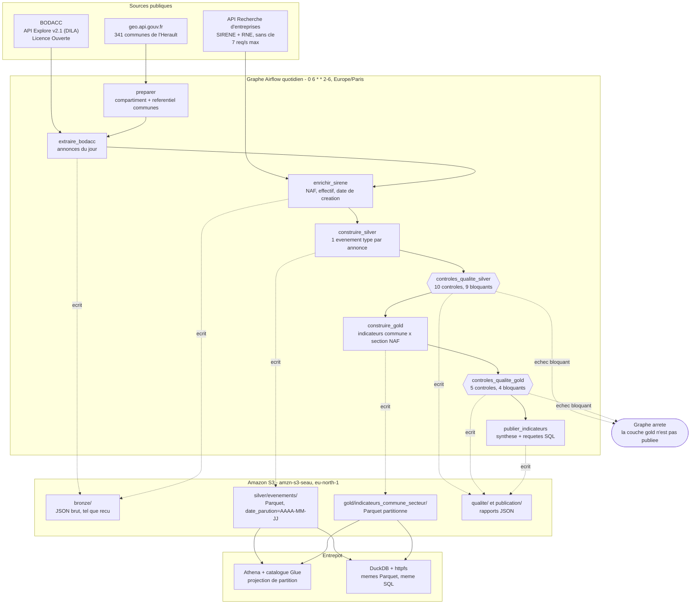
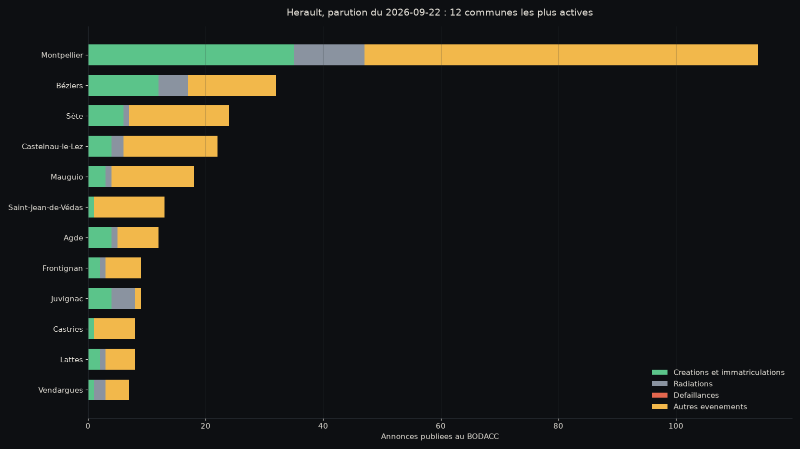
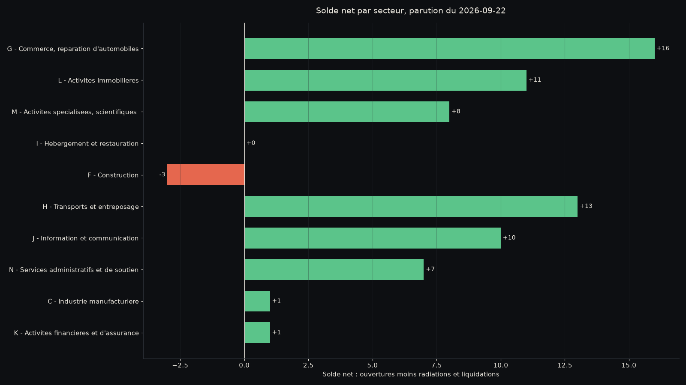
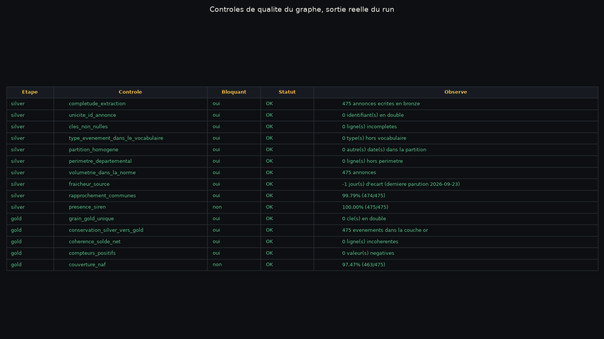
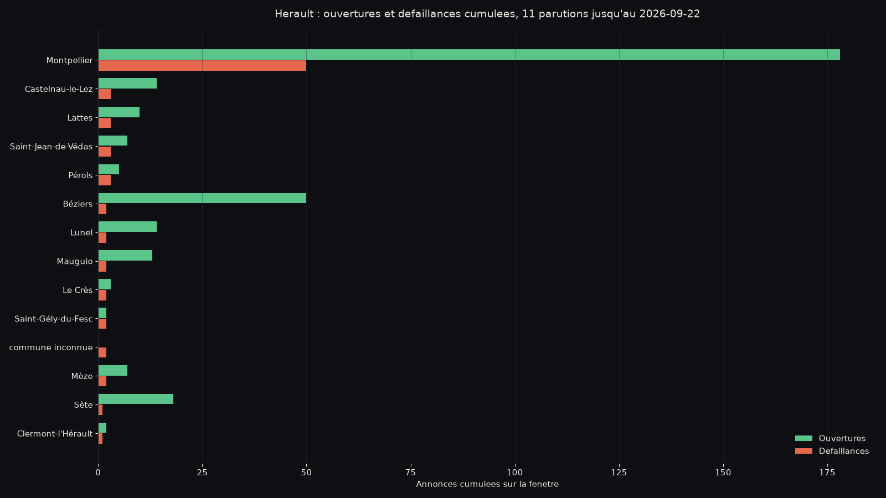

# Radar economique des entreprises de l'Herault

[](https://github.com/yzasmin/radar-entreprises-herault/actions/workflows/ci.yml)

Creations, immatriculations, transferts, ventes de fonds, radiations et procedures collectives des
entreprises de l'Herault, captes chaque jour au **BODACC**, enrichis par **SIRENE**, ranges en
Parquet partitionne sur **S3** en trois couches, controles par des tests de qualite **bloquants**, et
interrogeables en SQL par **Athena** ou par **DuckDB**. Le tout orchestre par un graphe **Airflow**
quotidien.

> **Ce qui a reellement tourne, et ou.** Les chiffres publies ci-dessous viennent d'une execution sur
> le **vrai compartiment S3** `amzn-s3-seau`, region `eu-north-1`, lancee depuis le poste : douze
> parutions du BODACC rejouees une par une, dont onze publiees et une refusee par les controles de
> qualite. L'**orchestration Airflow**, elle, est prouvee par le workflow d'integration continue, qui
> tourne contre un S3 emule par LocalStack. C'est volontaire : ce depot est public et ne porte aucune
> cle AWS reelle. Enfin, **Athena n'a pas tourne** ; le moteur de requete execute est DuckDB, sur
> exactement les memes fichiers Parquet. Le detail de qui prouve quoi est dans
> [Resultats reels](#resultats-reels).

Portfolio : <https://yzasmin.github.io/>

---

## Probleme

Une equipe commerciale qui prospecte dans l'Herault, un bailleur qui suit ses locataires
professionnels, un cabinet de conseil qui surveille un portefeuille de clients ont tous besoin de la
meme chose : savoir **qui ouvre, qui bouge et qui tombe**, par commune et par secteur, et le savoir
le jour ou c'est publie.

L'information existe et elle est publique. Le Bulletin officiel des annonces civiles et commerciales
publie chaque jour ouvre les creations, les immatriculations, les modifications, les radiations, les
ventes de fonds et les jugements de procedure collective. Mais telle quelle, elle est inexploitable :

- elle arrive **par annonce juridique**, pas par entreprise ni par territoire ;
- les champs qui portent le sens (`jugement`, `acte`, `listepersonnes`) sont du **JSON serialise dans
  une colonne texte**, et le montant d'une vente de fonds est une phrase en francais ;
- la **famille d'avis ment** : une « immatriculation » est souvent un simple transfert de siege, et
  une « liquidation sur conversion de redressement » contient les deux mots ;
- il n'y a **ni code commune, ni code d'activite** : seulement un nom de ville saisi a la main et un
  code postal.

Ce projet construit la brique manquante : un graphe quotidien qui capte ce flux, le normalise, le
rattache a une commune et a un secteur, refuse de publier si les donnees ne passent pas les controles,
et livre des indicateurs interrogeables en SQL.

---

## Architecture



### Les trois couches

| Couche | Contenu | Format | Partition |
| --- | --- | --- | --- |
| **bronze** | Les annonces telles que la source les rend, sans aucune transformation, plus les fiches SIRENE et le referentiel des communes | JSON | `date_parution=AAAA-MM-JJ` |
| **silver** | Un evenement type par annonce : type normalise, gravite, SIREN valide, commune du referentiel, section NAF, montant de vente | Parquet Snappy | `date_parution=AAAA-MM-JJ` |
| **gold** | Indicateurs quotidiens par commune et par section NAF : ouvertures, transferts, ventes, radiations, defaillances, solde net | Parquet Snappy | `date_parution=AAAA-MM-JJ` |

La cle de partition **n'est pas dans le fichier Parquet**, uniquement dans le chemin. Athena refuse
une colonne qui est aussi une colonne de partition, DuckDB echoue sur un nom en double avec
`hive_partitioning = true`, et la valeur n'est stockee qu'une fois au lieu d'une fois par ligne.
Un test verrouille cette propriete (`test_le_parquet_ne_contient_pas_la_cle_de_partition`).

### Ce que le code fait que la source ne fait pas

| Traitement | Pourquoi il est necessaire |
| --- | --- |
| Classement en 14 types d'evenements | La famille d'avis ne distingue ni le transfert de la creation, ni la liquidation du redressement. Le sens est dans le texte libre de `acte.descriptif` et de `jugement.complementJugement` |
| Validation du SIREN par cle de Luhn | Le champ `registre` est une liste qui repete la meme identite sous deux formes et melange vendeur et acheteur. Exception documentee par l'INSEE : le SIREN de La Poste (356000000) ne respecte pas la cle |
| Rattachement a une commune du referentiel | La source ne donne qu'un nom saisi a la main. Trois tentatives successives : nom normalise (accents, casse, `ST` en `SAINT`, arrondissements, `CEDEX`), puis code postal sans ambiguite, puis prefixe. L'echec est explicite, jamais devine |
| Lecture du montant d'une vente de fonds | Le prix est une phrase : « acquis par achat au prix stipule de 650000.00 euros ». Un montant illisible reste nul, jamais zero : zero est un prix, l'absence n'en est pas un |
| Section NAF a partir du code d'activite | Les 732 codes NAF ne se lisent pas ; les 21 sections oui |

---

## Resultats reels

### Ce qui a ete execute, et par quoi

| Preuve | Ou elle a ete produite | Cible S3 | Ce qu'elle etablit |
| --- | --- | --- | --- |
| **Chiffres publies** | Poste local, `./scripts/executer_sur_aws.sh` | **Vrai S3**, `amzn-s3-seau`, `eu-north-1` | Les donnees, les controles, les indicateurs et les couts |
| **Orchestration** | [Integration continue](https://github.com/yzasmin/radar-entreprises-herault/actions/workflows/ci.yml) | LocalStack | Le graphe se charge, s'execute de bout en bout, bloque, et se rejoue sans doubler |
| **Tests** | Les deux | Aucune | 135 tests passes ; 4 sautes hors conteneur, ceux qui demandent Airflow |

Docker Desktop est hors service sur le poste : le moteur plante sur un socket perime. L'ordonnanceur
ne peut donc pas y tourner, et c'est le runner d'integration continue qui fournit Docker. Le
`docker-compose.yml` reste utilisable tel quel sur une machine ou Docker fonctionne : c'est lui que
la CI monte, sans modification.

### Execution sur le vrai compte AWS

Douze parutions du BODACC rejouees, du 8 au 23 septembre 2026. Source : `results/execution_aws.json`.

| Mesure | Valeur | Fichier |
| --- | --- | --- |
| Parutions rejouees | 12 | `results/execution_aws.json` |
| Parutions publiees | 11 | `results/execution_aws.json` |
| Parutions **refusees par les controles** | 1, le 16 septembre | `results/execution_aws.json` |
| Duree totale | 1 371 s | `results/execution_aws.json` |
| Duree mediane d'une parution | 136 s | `results/execution_aws.json` |
| Objets ecrits sur S3 | 148 | `results/volumetrie.json` |
| Volume ecrit sur S3 | 17 592 164 octets, soit 17,6 Mo | `results/volumetrie.json` |

La parution du **16 septembre** a ete refusee, et c'est le resultat le plus utile du lot : le BODACC
n'avait publie **1 seule annonce** pour l'Herault ce jour-la. Le controle de volumetrie l'a vue, la
tache a leve, et la couche gold n'a pas ete publiee. Le motif tient en une ligne de journal, avec
l'attendu, l'observe et la facon dont l'attendu a ete calcule.

### Parution de reference : 22 septembre 2026

| Mesure | Valeur | Fichier |
| --- | --- | --- |
| Annonces extraites, couche bronze | 475 | `results/volumetrie.json` |
| Evenements types, couche silver | 475 | `results/volumetrie.json` |
| Lignes d'indicateurs, couche gold | 275 | `results/volumetrie.json` |
| Communes touchees | 117 | `results/synthese.json` |
| Annonces rattachees a une commune du referentiel | 99,79 %, soit 474 sur 475 | `results/controles_qualite.csv` |
| Annonces portant un SIREN valide | 100,00 %, soit 475 sur 475 | `results/controles_qualite.csv` |
| Annonces rattachees a une section NAF | 97,47 %, soit 463 sur 475 | `results/controles_qualite.csv` |
| Creations | 121 | `results/synthese.json` |
| Radiations | 53 | `results/synthese.json` |
| Transferts | 30 | `results/synthese.json` |
| Ventes de fonds | 8, dont 5 avec un prix lisible | `results/synthese.json` |
| Montant cumule des ventes lisibles | 1 374 086 euros | `results/synthese.json` |
| Solde net, ouvertures moins fermetures | +68 | `results/synthese.json` |
| Controles de qualite | 15, dont 13 bloquants, tous au vert | `results/controles_qualite.csv` |
| JSON brut vers Parquet Snappy | 954 123 vers 73 580 octets, facteur **12,97** | `results/volumetrie.json` |





### Les 15 controles de qualite, sortie reelle du run



Tableau complet dans `results/controles_qualite.csv`. Deux controles sont des **alertes** et non des
blocages : `presence_siren` et `couverture_naf`. Tous deux dependent d'une API tierce, dont la panne
doit degrader la richesse des indicateurs, pas empecher de publier les comptes par commune.

**Preuve que les blocages bloquent** : `scripts/preuve_blocage.py` force quatre situations anormales,
volumetrie effondree, source gelee, annonce publiee deux fois, evenements perdus entre silver et
gold, et exige que les quatre levent. En integration continue, **4 cas sur 4** ont arrete le graphe
(`results/localstack-ci/preuve_blocage.txt`).

### Fenetre glissante : 11 parutions, du 8 au 23 septembre 2026

Une seule journee ne suffit pas a voir le risque : le 22 septembre ne contient **aucune** procedure
collective. C'est la fenetre qui porte ce signal. Source : `results/resume_fenetre.json`.

| Mesure | Valeur |
| --- | --- |
| Evenements cumules | 3 589 |
| Communes touchees | 233 |
| Couples commune et secteur | 1 102 |
| Creations | 609 |
| Radiations | 362 |
| **Defaillances** | **93**, dont 62 liquidations, 29 redressements, 1 sauvegarde et 1 plan de cession |
| Transferts | 177 |
| Ventes de fonds | 39 |
| Solde net | +185 |



Trois lectures que ces chiffres autorisent, et qui sont le produit fini du radar :

1. **Montpellier concentre 50 des 93 defaillances**, soit 53,8 %, pour 178 creations. Aucune autre
   commune ne depasse 3 defaillances sur la periode.
2. **La construction est le seul grand secteur a solde negatif** : 21 defaillances pour 12 creations.
   L'hebergement et la restauration suivent, a 16 contre 18. Le commerce reste largement positif, avec
   14 defaillances pour 132 creations.
3. **La famille d'avis du BODACC ne suffit pas.** Sur les 11 parutions, le type normalise
   `immatriculation` ne compte **aucun** evenement : toutes les annonces de cette famille etaient en
   realite des transferts, reconnaissables au seul texte de l'acte. Les compter comme des creations
   aurait ajoute 177 fausses ouvertures a 609 reelles, soit une surestimation de 29,1 %.

### Entrepot : sept requetes SQL, deux moteurs possibles

Le meme fichier `sql/indicateurs.sql` s'execute sur Athena ou sur DuckDB. Ici, DuckDB, lisant les
Parquet directement depuis le vrai S3 par-dessus Internet. Source : `results/requetes_entrepot.json`.

| Requete | Lignes | Duree |
| --- | --- | --- |
| `solde_net_departement` | 1 | 2,222 s |
| `top_communes` | 117 | 1,328 s |
| `par_section` | 19 | 1,297 s |
| `signaux_du_jour` | 0 | 1,111 s |
| `prospects_creations` | 121 | 1,324 s |
| `ventes_de_fonds` | 8 | 1,440 s |
| `controle_croise_silver_gold` | 1 | 1,492 s |

La premiere requete porte le cout d'ouverture de la connexion et du chargement de l'extension
`httpfs` ; les suivantes tiennent sous 1,5 s, lecture reseau comprise.

### Cout reel sur la facture AWS

Tarifs publics de la region `eu-north-1`, releves le 24/09/2026 dans l'index de tarification officiel
d'AWS : stockage Standard 0,023 USD par Go et par mois, requetes PUT et LIST 0,005 USD pour 1 000,
requetes GET 0,0004 USD pour 1 000. Source : `results/cout_s3.json`.

| Poste | Valeur |
| --- | --- |
| Volume ecrit par les 11 parutions publiees | 17 592 164 octets, soit 0,0176 Go |
| Volume moyen par parution | 1 599 288 octets, soit 1,6 Mo |
| Stockage, aujourd'hui | **0,000405 USD par mois** |
| Ecritures, a 22 parutions par mois | 0,00088 USD par mois |
| Lectures, a 20 objets relus par parution | 0,000176 USD par mois |
| **Total aujourd'hui** | **0,0015 USD par mois** |
| Projection apres un an de collecte quotidienne | 0,3998 Go stockes, soit **0,0092 USD par mois** |

Autrement dit : a l'echelle d'un departement, le radar coute **moins d'un centime de dollar par mois**
la premiere annee. Ce n'est pas une surprise, c'est le resultat de deux decisions : le Parquet
compresse divise le volume par 13, et le partitionnement par date evite de relire ce qui ne change
pas. La facture deviendrait visible a l'echelle nationale, ou le meme jeu pese environ cent fois plus.

Nettoyer, pour ne rien laisser trainer sur le compartiment :

```bash
python -m uv run python -m radar.cli nettoyer              # liste, ne supprime rien
python -m uv run python -m radar.cli nettoyer --confirmer  # supprime le prefixe du projet
```


---

## Reproduire depuis un clone vierge

```bash
git clone https://github.com/yzasmin/radar-entreprises-herault.git
cd radar-entreprises-herault
cp .env.example .env          # valeurs par defaut : LocalStack, aucun secret
```

### Sans Docker : les tests et le pipeline en ligne de commande

```bash
# Environnement Python (uv telecharge Python 3.12 si besoin)
python -m uv sync --frozen

# Tests unitaires et style
python -m uv run pytest -q
python -m uv run ruff check src tests dags scripts

# Preuve que les controles de qualite bloquent reellement
python -m uv run python scripts/preuve_blocage.py

# Verifie que chaque chiffre du README existe dans results/
python -m uv run python scripts/verifier_chiffres.py README.md
```

Les tests du graphe Airflow sont **sautes** ici et annonces comme tels : Airflow n'est pas installe
sur un poste de developpement, il l'est dans le conteneur.

### Avec Docker : la pile complete

```bash
docker compose up -d --build          # Airflow, PostgreSQL et LocalStack
# Interface Airflow : http://localhost:8080 (identifiants dans .env)

# Executer reellement le graphe sur une parution
docker compose run --rm airflow-cli \
  airflow dags test radar_entreprises_herault 2026-09-22

# Exporter les chiffres publies et tracer les figures
AWS_ENDPOINT_URL=http://localhost:4566 \
  python -m uv run python scripts/export_results.py --jour 2026-09-22
python -m uv run python scripts/figures.py --jour 2026-09-22

docker compose down                   # arret propre, sans perdre les volumes
```

`make aide` liste les memes commandes sous forme de raccourcis.

### Infrastructure decrite en code

```bash
cd infra/terraform
terraform fmt -check -recursive
terraform init -backend=false
terraform validate                    # ne demande aucun compte AWS
```

---

## Bascule vers le vrai compte AWS, et repli sur LocalStack

Le projet vise **un seul point de variation** : la variable `AWS_ENDPOINT_URL`. Renseignee, le code
parle a LocalStack ; vide, il parle au vrai AWS. Rien d'autre ne change : memes appels boto3, meme
nom de compartiment, memes chemins, memes fichiers Parquet, meme SQL.

### Vers le vrai compte, en trois commandes

```bash
# 1. Renseigner la cle. AWS_ENDPOINT_URL doit rester VIDE : c'est cette ligne qui bascule.
$EDITOR .env        # AWS_ACCESS_KEY_ID, AWS_SECRET_ACCESS_KEY, AWS_ENDPOINT_URL=

# 2. Verifier que la cle voit ce qu'elle doit voir, et rien de plus
python -m uv run python -m radar.cli diagnostic

# 3. Rejouer le meme graphe sur le vrai compartiment
./scripts/bascule_aws.sh 2026-09-22          # avec Docker : passe par Airflow
./scripts/executer_sur_aws.sh 2026-09-22     # sans Docker : appelle les memes fonctions
```

La troisieme commande refuse de partir si `AWS_ENDPOINT_URL` n'est pas vide, si une variable manque,
ou si la cle ressemble a celle de LocalStack. Elle n'affiche jamais la cle et n'ecrit rien dans le
depot. C'est elle qui a produit les chiffres de ce README.

`scripts/executer_sur_aws.sh` accepte plusieurs dates d'un coup et journalise chaque parution,
reussite comme blocage, dans `results/execution_aws.json`.

### Repli sur LocalStack, pour qui n'a pas de compte

C'est le chemin par defaut de `.env.example`, et celui de l'integration continue :

```bash
cp .env.example .env        # AWS_ENDPOINT_URL=http://localstack:4566, cle « test »
docker compose up -d --build
docker compose run --rm airflow-cli airflow dags test radar_entreprises_herault 2026-09-22
```

Le projet reste donc entierement rejouable **sans compte AWS et sans carte bancaire**. C'est aussi ce
qui permet a ce depot public d'avoir un badge vert sans porter la moindre cle reelle.

### Region : eu-north-1 (Stockholm)

C'est la region **reelle** du compartiment `amzn-s3-seau`, verifiee par `get_bucket_location` et non
supposee. Le projet avait d'abord ete ecrit pour `eu-west-3` (Paris), par raisonnement : donnees
francaises, lecteur francais, region la plus proche. La verification a montre autre chose, et c'est la
verification qui gagne.

Le choix reste defendable tel quel :

1. **Residence des donnees dans l'Union europeenne.** Les annonces BODACC sont publiques, donc sans
   contrainte legale, mais garder l'ensemble du projet dans une region de l'UE evite d'avoir a se
   poser la question le jour ou une donnee client s'y ajoute.
2. **Le cout est le meme ou presque.** 0,023 USD par Go et par mois a Stockholm, soit le meme tarif
   qu'a Paris pour les 50 premiers teraoctets, et de toute facon invisible a 17,6 Mo.
3. **La latence ne se voit pas ici.** Le graphe ecrit une poignee d'objets par jour, et les requetes
   DuckDB depuis le poste tiennent sous 1,5 s sur le vrai S3, lecture reseau comprise.

La region est une variable, pas une constante : `AWS_REGION` ou `AWS_DEFAULT_REGION` dans `.env`,
`var.region` dans Terraform. Aucun code ne la contient en dur, et c'est ce qui a permis de corriger
l'erreur en une ligne.

### Integration continue : volontairement sans cle reelle

Le workflow de ce depot est public et **ne porte aucun secret**. Il monte LocalStack et le dit.
Configurer `AWS_ACCESS_KEY_ID` en secret GitHub sur un depot public permettrait a n'importe qui
d'executer ce qu'il veut sur le compte en ouvrant une pull request. Le badge vert prouve
l'orchestration, pas le cloud ; le cloud est prouve par l'execution locale et ses sorties dans
`results/`.

### Droits minimaux de la cle

La politique prete a coller est dans **`infra/politique-minimale.json`**, expliquee ligne par ligne
dans **`infra/POLITIQUE.md`**. En resume :

| Accorde | Sur |
| --- | --- |
| `s3:ListBucket`, `s3:GetBucketLocation` | `arn:aws:s3:::amzn-s3-seau`, avec une condition `s3:prefix` limitee a `radar/` |
| `s3:GetObject`, `s3:PutObject`, `s3:DeleteObject`, `s3:AbortMultipartUpload`, `s3:ListMultipartUploadParts` | `arn:aws:s3:::amzn-s3-seau/radar/*` |
| Un `Deny` explicite avec `NotResource` | tout ce qui sort du compartiment et de son prefixe |
| Un second `Deny` | `s3:DeleteBucket`, `s3:PutBucketPolicy`, `s3:PutBucketPublicAccessBlock` et les autres actions sur le compartiment lui-meme |

La seule suppression accordee est `s3:DeleteObject`, **sous le prefixe du projet uniquement**, et
elle ne sert qu'a la commande de nettoyage : le graphe, lui, ecrase une partition en reecrivant la
meme cle. `s3:DeleteBucket` est refuse explicitement, `s3:CreateBucket` n'est pas accorde, et
`s3:ListAllMyBuckets` non plus. Ce dernier point est **verifie sur la cle reelle** : `list_buckets`
renvoie `AccessDenied`, et le diagnostic l'affiche comme tel au lieu de s'arreter. Les droits Athena et Glue, necessaires seulement quand
`RADAR_MOTEUR=athena`, sont decrits dans `infra/terraform/iam.tf` et ne sont pas accordes tant
qu'Athena n'est pas utilise.

### Secrets

`.env` est dans `.gitignore`, `.env.example` est commite et ne contient que des valeurs LocalStack.
**Terraform cree l'utilisateur IAM et les politiques mais pas la cle d'acces** : une cle creee par
Terraform finirait en clair dans le fichier d'etat. Elle se cree a la main, une fois, et va dans
`.env` ou dans un secret GitHub. Le depot a ete scanne avant chaque publication.

---

## Structure

```
radar-entreprises-herault/
├── dags/radar_entreprises.py        Le graphe, et rien que le graphe
├── src/radar/
│   ├── config.py                    Tout vient de l'environnement, aucun secret en dur
│   ├── extract.py                   BODACC, SIRENE, referentiel geo, cadence de requetes
│   ├── transform.py                 Fonctions pures : classement, SIREN, communes, agregats
│   ├── quality.py                   14 controles, bloquants ou non, rendus en tableau lisible
│   ├── storage.py                   boto3 : memes appels sur LocalStack et sur AWS
│   ├── warehouse.py                 Athena et DuckDB derriere la meme fonction
│   ├── pipeline.py                  Une fonction par tache du graphe
│   └── cli.py                       Rejouer une etape ou tout le graphe, sans ordonnanceur
├── sql/
│   ├── indicateurs.sql              7 requetes, le meme texte pour les deux moteurs
│   └── athena_ddl.sql               Tables externes avec projection de partition
├── infra/
│   ├── politique-minimale.json      Politique IAM prete a coller dans la console
│   ├── POLITIQUE.md                 Ce qu'elle autorise, ce qu'elle refuse, et pourquoi
│   └── terraform/                   Compartiment, catalogue Glue, workgroup Athena, IAM
├── scripts/
│   ├── export_results.py            Ecrit dans results/ tout ce qui est publie
│   ├── figures.py                   Graphiques du README, de la fiche et du teaser
│   ├── preuve_blocage.py            Prouve que les controles arretent le graphe
│   ├── verifier_chiffres.py         Verifie que chaque nombre publie existe dans results/
│   └── bascule_aws.sh               Bascule vers le vrai compte, en une commande
├── tests/                           Transformations, qualite, S3 simule (moto), graphe Airflow
├── results/                         Sorties chiffrees du run d'integration continue
├── teaser/                          variables.json et figure 1600x900 du portfolio
├── docker/Dockerfile.airflow        Airflow 2.10.5 epingle, plus quatre dependances
└── docker-compose.yml               Airflow LocalExecutor, PostgreSQL, LocalStack
```

---

## Donnees et licences

| Source | Ce qu'elle apporte | Licence | Frequence | Verifie le |
| --- | --- | --- | --- | --- |
| [BODACC](https://www.data.gouv.fr/fr/datasets/bodacc/), API Explore v2.1 d'Opendatasoft hebergee par la DILA | Les annonces legales : creations, immatriculations, modifications, radiations, ventes et cessions, procedures collectives, depots des comptes | **Licence Ouverte** (`FR-LO`), producteur DILA (services du Premier ministre) | Quotidienne, du mardi au samedi | 24/09/2026 |
| [API Recherche d'entreprises](https://recherche-entreprises.api.gouv.fr/docs/) | Code NAF, tranche d'effectif, date de creation, commune du siege | Donnees SIRENE et RNE sous **Licence Ouverte 2.0**, code de l'API sous MIT. **Sans cle**, 7 requetes par seconde et par adresse IP | Quotidienne | 24/09/2026 |
| [geo.api.gouv.fr](https://geo.api.gouv.fr/decoupage-administratif/communes) | Les 341 communes de l'Herault : code INSEE, codes postaux, population, centroide | **Licence Ouverte** | Annuelle | 24/09/2026 |

Volumetrie constatee le 24/09/2026, relevee par `scripts/verifier_sources.py` et enregistree dans
`results/sources_verifiees.json` : **50 778 718** annonces au total dans le jeu BODACC, dont
**1 086 632** pour le seul departement de l'Herault. La parution du jour meme etait deja interrogeable.

### Ce qui a ete evalue puis ecarte, et pourquoi

| Source | Mesure | Decision |
| --- | --- | --- |
| **Fichiers stock SIRENE** sur data.gouv.fr (Licence Ouverte 2.0) | `StockEtablissement` en Parquet : **2 210 114 710 octets**, plus 708 557 254 octets pour `StockUniteLegale`. Mise a jour **mensuelle** | Ecarte. Un stock mensuel ne peut pas porter un radar quotidien, et 2,2 Go a telecharger puis filtrer a chaque rafraichissement sur un poste de 8 Go de memoire vive n'est pas tenable |
| **API SIRENE de l'INSEE**, version 3.11 | **HTTP 401** sans jeton : un compte INSEE et une cle sont necessaires | Ecarte pour l'instant. C'est la porte a reprendre le jour ou la cle existe, pour acceder aux variables non diffusibles |
| **Enumeration des etablissements par l'API ouverte** | `?departement=34` renvoie `total_results: 10000`, qui est le **plafond de pagination**, pas un comptage | Ecarte. C'est ce qui a decide l'architecture : le flux porte la liste, le referentiel ne fait qu'enrichir. Quelques centaines d'appels par jour au lieu de 2,2 Go par mois |

### Perimetre et extension

Le perimetre est le **departement 34**, fixe par la variable `RADAR_DEPARTEMENT`. Pour l'etendre :

- **A un autre departement** : changer `RADAR_DEPARTEMENT`. Rien d'autre. Le referentiel des communes
  est charge depuis `geo.api.gouv.fr` pour le departement demande, et le controle
  `perimetre_departemental` verifie que tous les codes commune en decoulent.
- **A une region ou a la France entiere** : il faut sortir du plafond de pagination de 10 000 lignes
  de l'API Explore. Deux voies, dans l'ordre de cout : decouper la requete par famille d'avis puis par
  departement (le code leve deja explicitement quand le plafond est atteint, au lieu de tronquer en
  silence), ou passer au flux XML annuel publie sur data.gouv.fr, qui pese environ 50 Go et demande
  une autre chaine de lecture.
- **A une profondeur historique** : le graphe accepte n'importe quelle date de parution. Rejouer un an
  demande 250 executions, soit environ deux heures a la cadence actuelle.

### Ce qui n'est pas commite

Aucune donnee source n'est versionnee : le graphe les telecharge. Seules les **sorties chiffrees**
sont dans `results/`, parce que c'est la regle du portfolio : tout chiffre publie doit s'y retrouver.

---

## Limites

**Ce que le projet ne demontre pas.**

1. **Athena n'a pas tourne.** LocalStack en edition communautaire ne l'emule pas, et le vrai Athena
   n'a pas ete branche. Le SQL est ecrit pour les deux moteurs, la declaration des tables externes
   avec projection de partition est dans `sql/athena_ddl.sql`, la politique IAM correspondante est
   dans `infra/terraform/iam.tf`, mais **rien de tout cela n'a ete execute**. Le moteur reellement
   utilise est DuckDB.
2. **Terraform n'a pas ete applique.** `terraform fmt`, `terraform init -backend=false` et
   `terraform validate` passent en integration continue, et c'est tout ce qui est prouve. Le
   compartiment `amzn-s3-seau` a ete cree a la main dans la console avant que l'infrastructure ne soit
   decrite ; la configuration sait le lire au lieu de le creer (`compartiment_existant = true`), mais
   aucun `terraform apply` n'a ete lance.
3. **L'orchestration et les chiffres ne viennent pas du meme endroit.** Le graphe Airflow tourne en
   integration continue contre LocalStack ; les chiffres publies viennent d'une execution sur le vrai
   S3 lancee en ligne de commande. Les deux appellent exactement les memes fonctions, dans le meme
   ordre, mais il n'existe pas de capture d'Airflow pilotant le vrai compartiment.

**Ce qui casserait en production, par ordre de probabilite.**

1. **La classification repose sur du texte libre.** Un transfert se reconnait au mot « transfert »
   dans `acte.descriptif`, une liquidation au texte du jugement. Si la DILA reformule ses libelles, le
   classement se degrade **sans qu'aucun controle ne le voie** : les comptes restent coherents, ils
   comptent simplement autre chose. C'est le premier chantier : un controle de derive sur la
   repartition des types d'un jour a l'autre.
2. **L'enrichissement depend d'une API tierce sans engagement de service.** Elle accepte sept
   requetes par seconde et par adresse IP ; le pipeline en fait cinq, avec un jeton partage entre cinq
   fils. Un cache par SIREN serait la premiere optimisation utile : les memes entreprises reviennent
   d'une annonce a l'autre.
3. **Le graphe relit tout un jour a chaque execution.** Acceptable a 475 annonces par jour pour un
   departement. A l'echelle nationale, il faudrait sortir du plafond de pagination de 10 000 lignes de
   l'API Explore, donc decouper par famille d'avis, et passer a une ecriture par lots.
4. **Rien n'est surveille.** Pas d'alerte sur l'echec d'un graphe, pas de destinataire. Aujourd'hui,
   un blocage se voit dans l'interface d'Airflow et nulle part ailleurs. En production, une
   notification sur echec de tache passerait avant toute nouvelle fonctionnalite.

**Une limite de fond, qui n'est pas technique.** Le BODACC dit ce qui est **publie**, pas ce qui
**existe**. Une entreprise en difficulte qui n'est pas passee devant un tribunal n'y figure pas, une
micro-entreprise sans immatriculation au RCS non plus, et une cessation d'activite sans radiation
formelle reste invisible. Le radar mesure un flux d'annonces legales, pas l'economie reelle. Les
chiffres de creations et de defaillances de ce depot ne sont donc **pas** comparables aux series de
l'INSEE ou de la Banque de France, qui ne comptent ni la meme chose ni de la meme facon.

**Les suites utiles, dans l'ordre.** Un controle de derive sur la repartition des types ; un cache
SIREN ; une alerte sur echec de tache ; puis, seulement ensuite, brancher Athena et appliquer
Terraform sur le vrai compte.


---

## Credits

- **Donnees** : DILA (BODACC), INSEE et INPI via l'API Recherche d'entreprises, Etalab
  (geo.api.gouv.fr). Toutes sous Licence Ouverte.
- **Outils** : Apache Airflow 2.10.5, LocalStack, DuckDB, PyArrow, boto3, Terraform, moto, pytest, ruff.
- **Auteur** : Yasmina Saoud. Code sous licence MIT (`LICENSE`).
